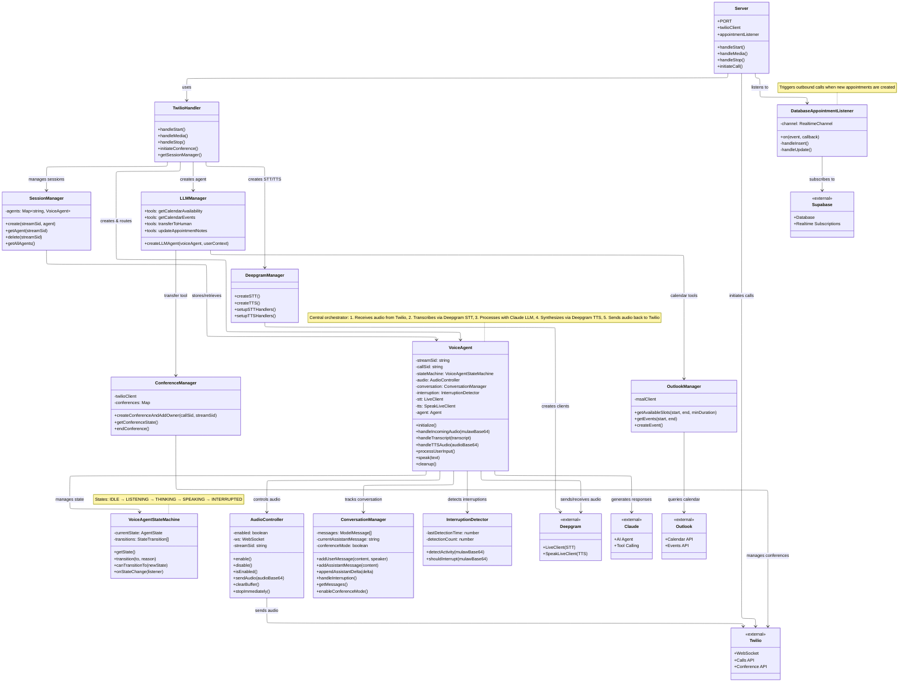

# Architecture Diagram

This diagram illustrates the core architecture and information flow of the Personal Assistant Voice Agent system.

## Information Flow

### Inbound Call Flow

1. **Call Initiation**: Twilio receives incoming call and opens WebSocket connection
2. **Session Setup**: `TwilioHandler.handleStart()` creates:
   - Deepgram STT/TTS clients via `DeepgramManager`
   - LLM Agent with tools via `LLMManager`
   - `VoiceAgent` instance with all dependencies
3. **Registration**: `SessionManager` stores the VoiceAgent by streamSid
4. **Audio Loop**:
   - Twilio → `VoiceAgent.handleIncomingAudio()` → Deepgram STT
   - Deepgram STT → `VoiceAgent.handleTranscript()` → State transition to THINKING
   - `VoiceAgent.processUserInput()` → Claude LLM (with calendar tools)
   - LLM response → `VoiceAgent.speak()` → Deepgram TTS
   - Deepgram TTS → `VoiceAgent.handleTTSAudio()` → AudioController → Twilio

### Outbound Call Flow

1. **Appointment Created**: User creates appointment via web frontend
2. **Database Trigger**: Supabase realtime event fires
3. **Listener Notification**: `DatabaseAppointmentListener` receives event
4. **Call Initiation**: Server calls API endpoint `/api/calls/:number`
5. **Same as Inbound**: Once connected, follows same audio loop

### State Management

The `VoiceAgentStateMachine` enforces valid state transitions:

- **IDLE** → **LISTENING**: Call starts
- **LISTENING** → **THINKING**: User finishes speaking (transcript received)
- **THINKING** → **SPEAKING**: LLM generates response, TTS begins
- **SPEAKING** → **INTERRUPTED**: User speaks during agent speech
- **SPEAKING** → **LISTENING**: Agent finishes speaking
- **INTERRUPTED** → **LISTENING**: Interrupt handled, ready for user

### Conference/Transfer Flow

1. User requests human via LLM tool `transferToHuman()`
2. `ConferenceManager.createConferenceAndAddOwner()` is called
3. Twilio Conference created and owner is dialed in
4. Original call moved to conference
5. AI disconnects, caller and owner continue directly

## Key Design Patterns

### Component Separation
- **Core**: Business logic (VoiceAgent, StateMachine, ConversationManager)
- **Managers**: External service integration (Deepgram, LLM, Outlook)
- **Handlers**: Protocol/API handling (TwilioHandler)
- **Utils**: Shared utilities

### Single Responsibility
- Each class has one clear purpose
- VoiceAgent orchestrates but delegates to specialists
- State management separated from audio/conversation logic

### Event-Driven Architecture
- Database changes trigger appointments via EventEmitter
- State transitions notify listeners
- Deepgram events drive audio pipeline
