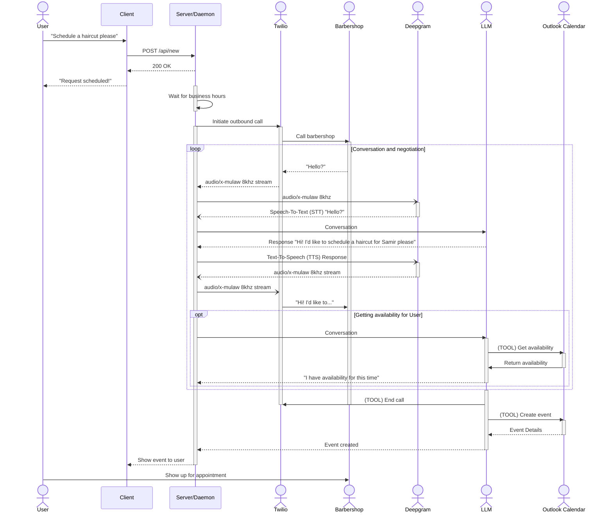

# System Design

There are multiple components working together to create the assistant. Our stack:
* [**Twilio**](https://www.twilio.com/en-us/voice) - Phone service provider. Handles inbound and outbound calls.
* [**Deepgram**](https://developers.deepgram.com/home) - Text-To-Speech (TTS) and Speech-To-Text (STT). We can stream it audio in 8khz µlaw base64 format and it will stream back matching text, and vice versa streaming it text and it streams back 8khz µlaw base64-encoded audio.
* **LLM** - Whichever LLM we choose to use, I'm parital to [Claude Haiku](https://www.anthropic.com/claude/haiku) because of its simplicity, how fast it is, and how cheap it is per token.
* **Our server** - We'll be using [Bun.js](https://bun.sh/) for the runtime and [Elysia](https://elysiajs.com/) as the web server. Essentially all of the services report back to our server through Websockets which we can then process and route to where they need to go.

## High-level overview
The system works in a loop for the most part. Twilio first initiates the outbound call to, for example, a barbershop. 
1. A person picks up the phone and says "Hello?" 
2. That audio data is then **streamed** via a websocket to our server, 
3. which **streams** it right back out to Deepgram STT. 
4. Deepgram then **streams** the text back to our server, which stores it in a conversation history.
5. Our server then sends the conversation history to the LLM to generate a response
6. The LLM **streams** tokens back to the server
7. The server **streams** those tokens to Deepgram TTS
8. Deepgram **streams** the audio data back to our server
9. Our server **streams** the audio back to Twilio, which relays it back to the Barbershop.

Most things about this system are happening asynchronously via streams to reduce roundtrip latency (Barbershop request -> Response). We're aiming for \<100ms roundtrip.
<!-- "\<" is necessary here because otherwise Docusaurus interprets the "<" as the beginning
of an HTML tag. -->

Occasionally the LLM will make calls to external **tools**. Luckily, this is fairly easy to implement thanks to the package we'll be using to handle LLM requests: [`ai`](https://npmjs.com/package/ai) by Vercel.

## Sequence Diagram

