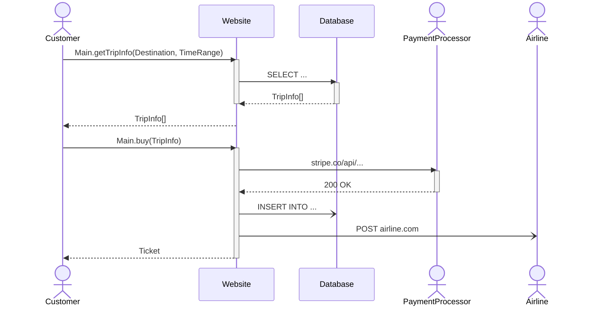

# Moar

Mermaid charts:

```mermaid
sequenceDiagram
    actor Customer
    participant Website
    participant Database
    actor PaymentProcessor
    actor Airline

    Customer ->> Website: Main.getTripInfo(Destination, TimeRange)
    activate Website
    Website ->> Database: SELECT ...

    activate Database
    Database -->> Website: TripInfo[]
    deactivate Database

    deactivate Website
    Website -->> Customer: TripInfo[]

    Customer ->> Website: Main.buy(TripInfo)
    activate Website

    Website ->> PaymentProcessor: stripe.co/api/...
    activate PaymentProcessor
    PaymentProcessor -->> Website: 200 OK
    deactivate PaymentProcessor
    Website -) Database: INSERT INTO ...
    Website -) Airline: POST airline.com
    Website -->> Customer: Ticket

    deactivate Website
```
