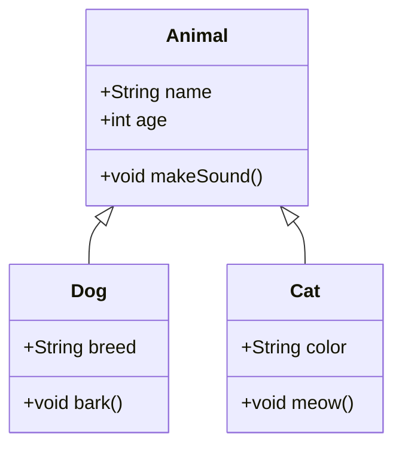
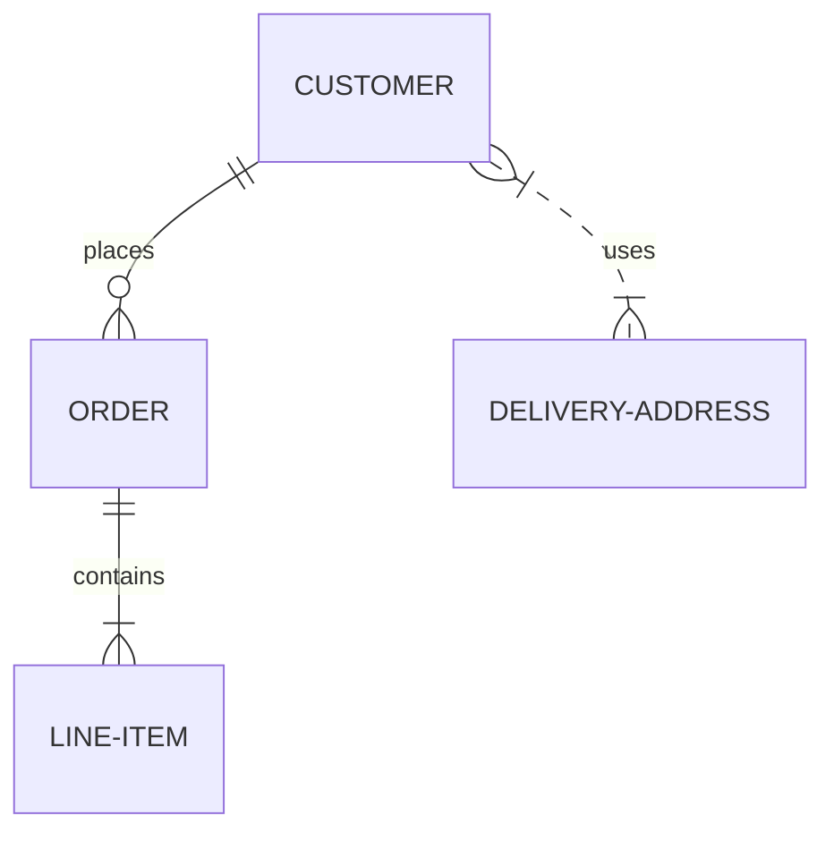
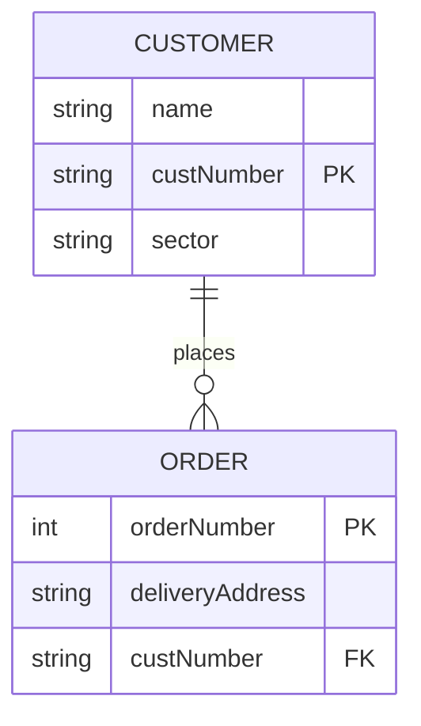
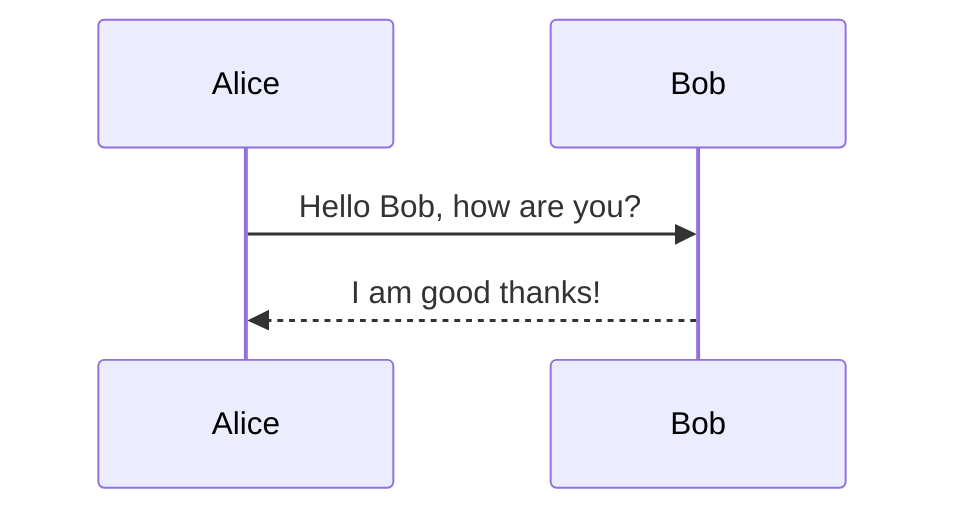
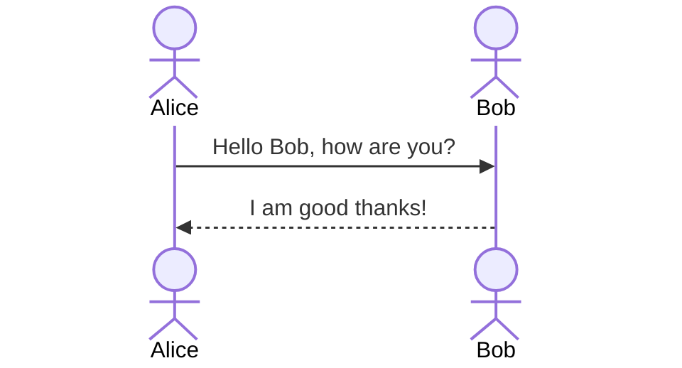
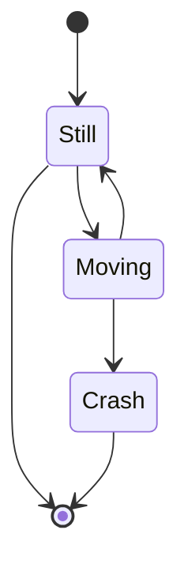
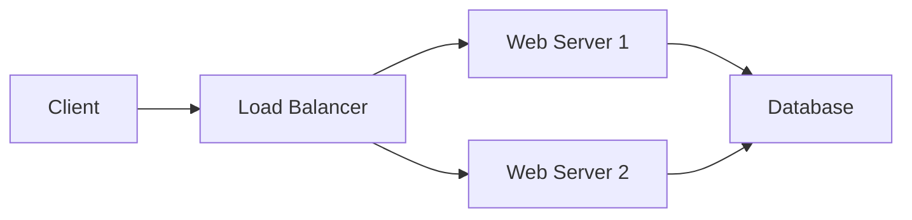
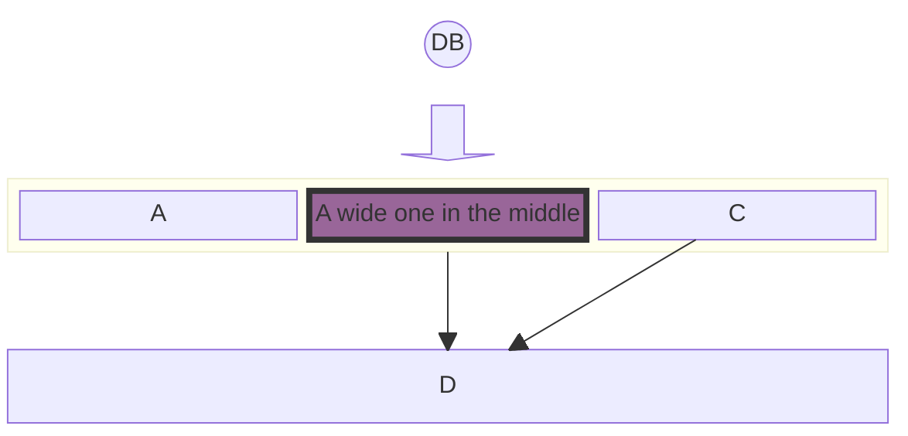
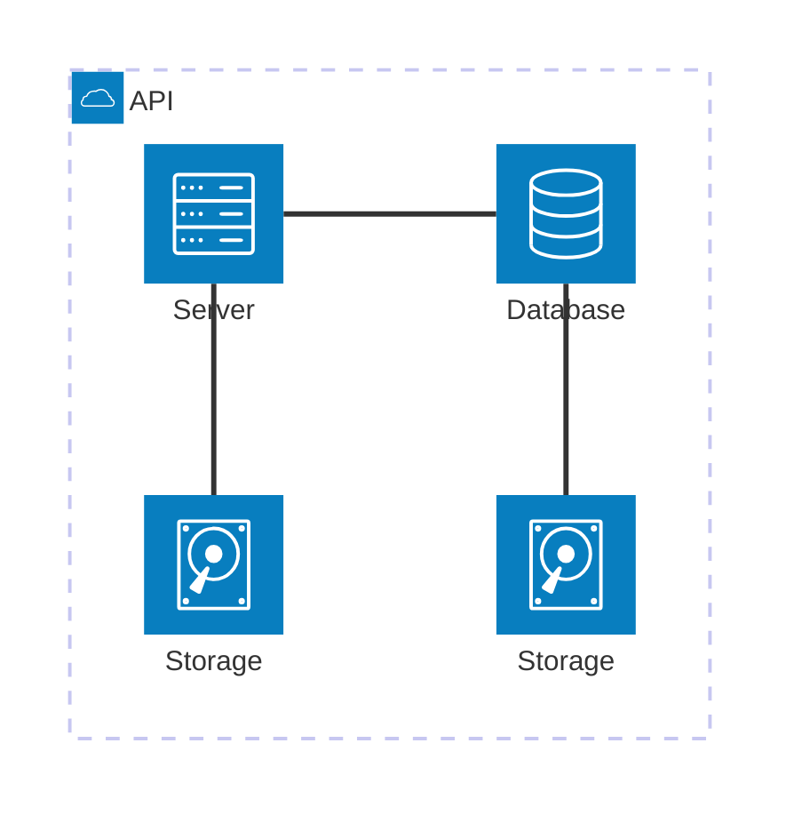

# Mermaid Diagrams (UML) 🧜‍♀️
Using [Mermaid](https://mermaid-js.github.io/mermaid/#/) to create diagrams and visualizations directly in Docusaurus offers significant advantages over static images. With Mermaid, your diagrams are written as code, making them easy to version control, review, and update alongside your documentation. This approach ensures your diagrams always stay in sync with your project, reduces maintenance overhead, and eliminates the hassle of regenerating and uploading new images for every change. As your project evolves, updating a diagram is as simple as editing a few lines of text, making your documentation more agile, consistent, and future-proof.
Mermaid supports a variety of diagram types, including flowcharts, sequence diagrams, class diagrams, state diagrams, and more. Below are some examples of how to create different types of UML diagrams using Mermaid syntax.

## Structural
### Class Diagrams
Class diagrams are used to represent the structure of a system by showing its classes, attributes, methods, and the relationships between them. Here's an example of a simple class diagram:

````md

````
This will render the following diagram:


### Entity-Relationship Diagrams (not technically UML, but widely used in software design)
Entity-Relationship diagrams are used to represent the relationships between entities in a database. Here's an example of a simple ER diagram:

````md

````
This will render the following diagram:


You can also define entities with attributes primary keys and foreign keys:

````md

````


## Behavioral
### Sequence Diagram
Sequence diagrams are used to represent interactions between different entities over time. Here's an example of a simple sequence diagram:

````md

````

This will render the following diagram:


You can also represent participants and actors:

````md

````


### State Diagrams
State diagrams are used to represent the states of an object and the transitions between those states. Here's an example of a simple state diagram:

````md

````
This will render the following diagram:


### Use Case Diagrams
There is currently no official support for Use Case diagrams in Mermaid... maybe some day... until then you may have to resort to images from draw.io or similar tools. 


## Non UML Examples (Architectural Diagrams)
UML is great for standardized diagrams, but there many diagrams that aren't covered by UML such as system block diagrams. Mermaid can also be used to create these types of diagrams. Theres 3 ways currently to draw system block diagrams in Mermaid (some of which are still in beta). Here's an example of a simple system block diagram using the `graph` syntax:

````md

````


Graphs are great, but you have less control over the layout. If you want more control over the layout, you can use the `block` syntax:

````md

````


There is also a new `architecture` syntax that is still in beta, but provides a more industry standard SaaS architecture layout great for cloud based systems:

````md

````


